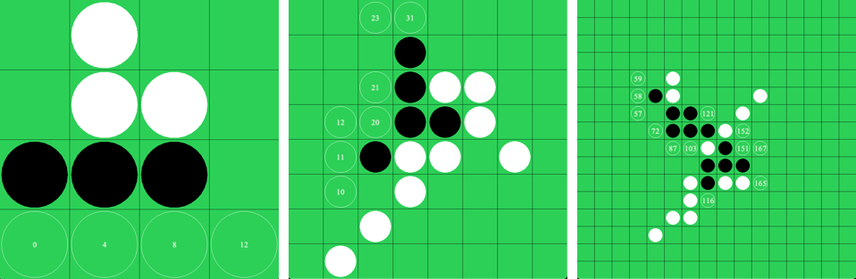

  

# Othello Gym Environment

This repository contains an implementation of [Othello](https://en.wikipedia.org/wiki/Othello) with OpenAI Gym interfaces, we allow users to specify various board sizes. This environment is for researchers and engineers who are interested in developing model-based RL algorithms.

To benchmark your RL agent, we provide several simple baselines:
1. Random policy
2. Greedy policy
3. [Maximin](https://en.wikipedia.org/wiki/Minimax) policy
4. Human policy
5. More to come

## Basic Usage

```
# Human vs Human (protagonist plays black, black plays first)
python run.py --protagonist='human' --opponent='human'

# Human vs Human (protagonist plays white)
python run.py --protagonist='human' --opponent='human' --protagonist-plays-white

# Human vs Greedy
python run.py --protagonist='human' --opponent='greedy'

# Human vs Greedy (no rendering)
python run.py --protagonist='human' --opponent='greedy' --no-render

# Maximin (depth=2) vs Greedy
python run.py --protagonist='maximin' --protagonist-search-depth=2 --opponent='greedy'
```
See `run.py` for how to use the environment to integrate your agents.

## Evaluation between Policies

We report scores from policies playing against each other on a 8x8 board.  
Each policy pair plays 100 games, and in each game the first 10 moves (5 from each side) are random.  
We report the number of `wins / draws / loses` from the protagonist's perspective.

Policies (protagonist) in the first column plays black, those in the header row plays white, black plays first.  
Therefore, if you read along each row, numbers in the cell are `wins / draws / loses` for the policy on the left.  
If you read along each column, the numbers become `loses / draws / wins` for the policy at the top.

|                          | Random      | Greedy      | Maximin-1 | Maximin-2 | Maximin-3 |
|--------------------------|-------------|-------------|-------------------|-------------------|-------------------|
| <b>Random</b>            | 48 / 6 / 46 | 38 / 1 / 61 | 38 / 1 / 61       | 32 / 4 / 64       | 13 / 2 / 85       |
| <b>Greedy</b>            | 61 / 5 / 34 | 42 / 4 / 54 | 42 / 4 / 54       | 27 / 3 / 70       | 25 / 1 / 74       |
| <b>Maximin-1</b> | 61 / 5 / 34 | 42 / 4 / 54 | 42 / 4 / 54       | 27 / 3 / 70       | 25 / 1 / 74       |
| <b>Maximin-2</b> | 72 / 1 / 27 | 67 / 1 / 32 | 67 / 1 / 32       | 35 / 1 / 64       | 33 / 2 / 65       |
| <b>Maximin-3</b> | 78 / 3 / 19 | 66 / 4 / 30 | 66 / 4 / 30       | 63 / 2 / 35       | 46 / 1 / 53       |

Things worth noticing from the results:
1. From the diagonal entries, it seems that when the two sides are equally strong white has an advantage in Othello.
2. **Maximin-1** is equivalent to **Greedy**, they thus have the same scores.
3. The deeper one searches in **Maximin** (the number in the name indicates search depth), the better the performance. However, more computation is required too.
This can be improved by [pruning](https://en.wikipedia.org/wiki/Alpha%E2%80%93beta_pruning) (not included in this repo).

## Citation
Please use this BibTeX to cite this repository in your publications:
```
@misc{gymothelloenv,
  author = {Yujin Tang},
  title = {Othello Gym Environment},
  year = {2020},
  publisher = {GitHub},
  journal = {GitHub repository},
  howpublished = {\url{https://github.com/lerrytang/GymOthelloEnv}},
}
```
